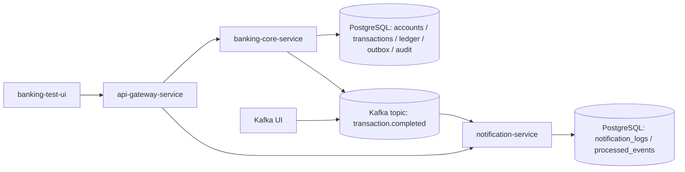
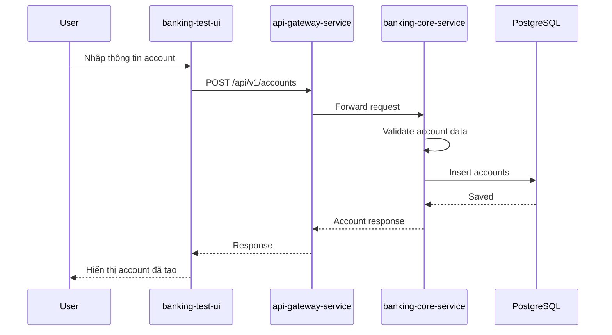
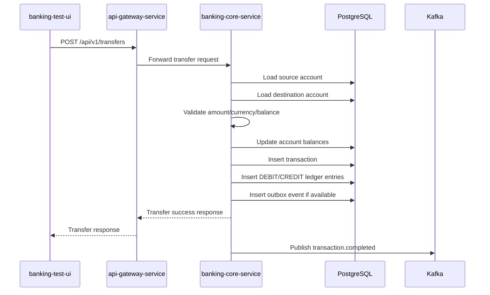
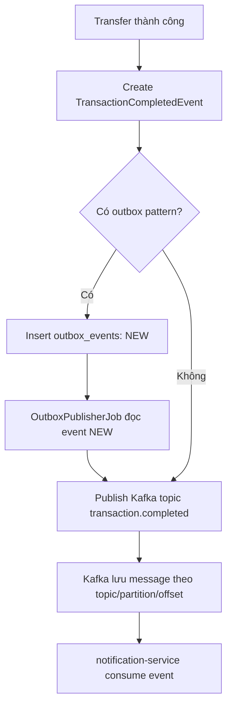
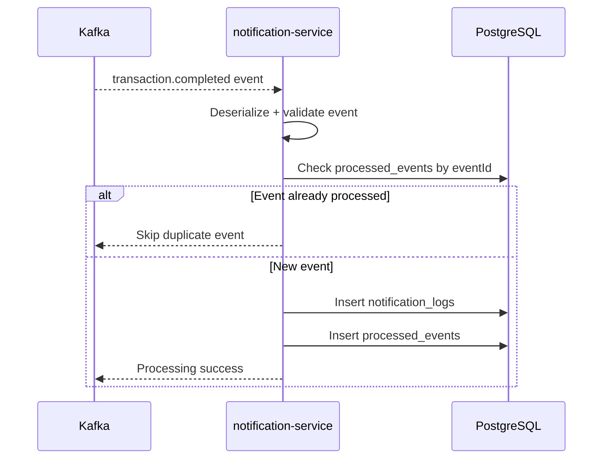
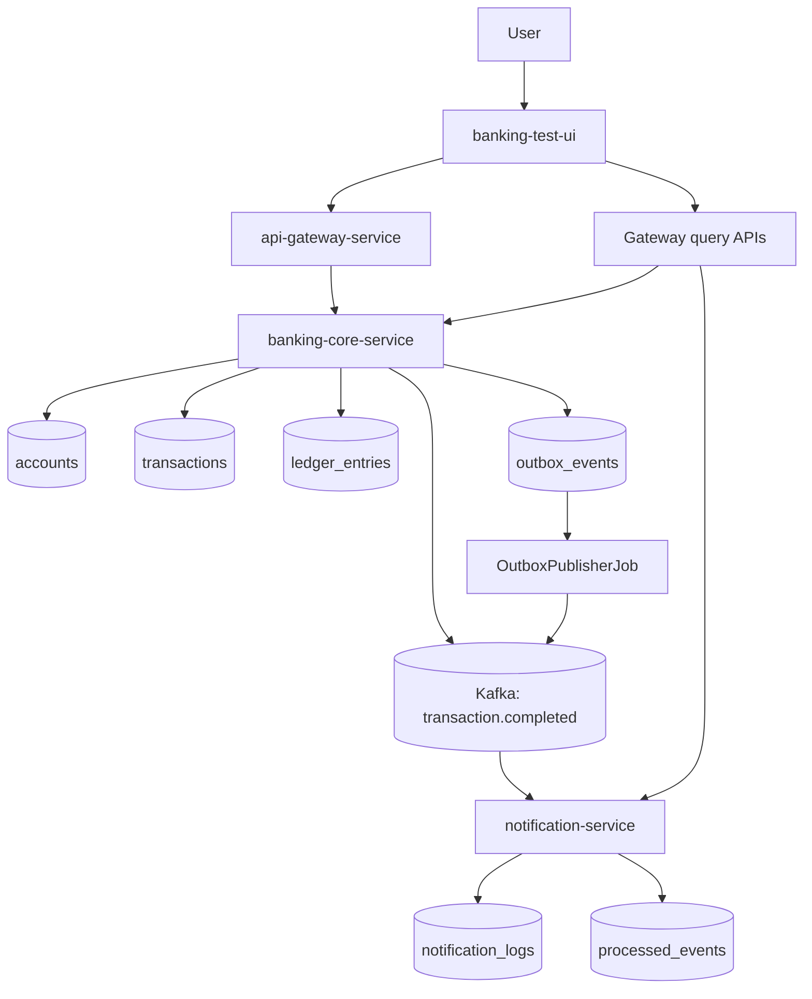

# Kafka Core Banking Flow

Tài liệu này mô tả luồng runtime end-to-end hiện có của workspace `mini-core-banking-kafka` dựa trên source code, cấu hình và migration đang được check in.

## 1. Tổng quan hệ thống hiện tại

Hệ thống hiện tại gồm các thành phần chính sau:

- `banking-ui`:
  - UI để test nghiệp vụ core banking.
  - Gọi API qua `api-gateway-service`.
  - Một số màn hình gọi API thật, một số màn hình có cơ chế fallback sang demo data để UI vẫn usable khi backend chưa chạy.
  - Trong tài liệu này, `banking-ui` chính là vai trò `banking-test-ui`.

- `api-gateway-service`:
  - Cổng vào duy nhất cho frontend tại port `8080`.
  - Route request sang `banking-core-service` hoặc `notification-service`.
  - Có `X-Correlation-Id`, request logging và fallback `503` khi downstream unavailable.
  - Có cấu hình CORS trong `application.yaml` cho origin `http://localhost:5173`; tuy nhiên hiệu lực runtime của phần CORS nên được xác nhận thêm vì cấu hình đang nằm trong YAML thay vì được thể hiện bằng Java config riêng.

- `banking-core-service`:
  - Quản lý account.
  - Xử lý transfer.
  - Lưu `transactions`.
  - Lưu `ledger_entries`.
  - Lưu `outbox_events`.
  - Có `OutboxPublisherJob` publish Kafka event `transaction.completed`.
  - Có `idempotency_keys` cho API transfer.
  - Có `audit_logs` cho các action như create account, transfer, create outbox event, publish Kafka event.

- `Kafka`:
  - Message broker.
  - Topic chính đang dùng là `transaction.completed`.
  - Có `Kafka UI` để quan sát topic/message.

- `notification-service`:
  - Consume `transaction.completed`.
  - Lưu `notification_logs`.
  - Lưu `processed_events` để chống duplicate event.
  - Có error handler + DLT cho poison message/deserialization failure.

- `PostgreSQL`:
  - Lưu dữ liệu core banking và notification trong cùng database `banking`.
  - Core service dùng các bảng như `accounts`, `transactions`, `ledger_entries`, `outbox_events`, `idempotency_keys`, `audit_logs`.
  - Notification service dùng `notification_logs`, `processed_events`.

## 2. Architecture diagram



Giải thích các mũi tên:

- `UI -> GW`: frontend luôn gọi vào gateway, không gọi thẳng core hay notification service.
- `GW -> Core`: gateway chuyển các API account, transfer, transaction, statement, outbox, audit sang `banking-core-service`.
- `GW -> Noti`: gateway chuyển các API notification, processed-events và health của notification service sang `notification-service`.
- `Core -> CoreDB`: core service đọc/ghi dữ liệu nghiệp vụ chính vào PostgreSQL.
- `Core -> Kafka`: core service không publish trực tiếp trong request transfer nữa; nó ghi `outbox_events`, sau đó `OutboxPublisherJob` publish lên Kafka.
- `Kafka -> Noti`: notification service consume event `transaction.completed`.
- `Noti -> NotiDB`: notification service lưu notification log và dấu vết processed event vào PostgreSQL.
- `KafkaUI -> Kafka`: Kafka UI chỉ để quan sát topic, partition, offset và message.

## 3. Danh sách chức năng hiện tại

| Module/Service | Chức năng | API/Topic/Bảng liên quan | Ý nghĩa nghiệp vụ |
|---|---|---|---|
| `banking-core-service` | Create account | `POST /api/v1/accounts`, bảng `accounts` | Tạo tài khoản để nạp số dư và làm nguồn/đích cho transfer |
| `banking-core-service` | Get account | `GET /api/v1/accounts/{accountNo}`, bảng `accounts` | Tra cứu trạng thái và số dư hiện tại của 1 account |
| `banking-core-service` | List account | `GET /api/v1/accounts` | Xem danh sách account theo page |
| `banking-core-service` | Transfer money | `POST /api/v1/transfers`, bảng `accounts`, `transactions`, `ledger_entries`, `idempotency_keys` | Ghi nhận nghiệp vụ chuyển tiền, cập nhật số dư và chống double submit |
| `banking-core-service` | Transaction history | `GET /api/v1/transactions`, `GET /api/v1/transactions/{referenceNo}`, bảng `transactions` | Tra cứu lịch sử transfer theo mã hoặc filter |
| `banking-core-service` | Account statement / ledger | `GET /api/v1/accounts/{accountNo}/statement`, bảng `ledger_entries` | Xem debit/credit theo account và khoảng ngày |
| `banking-core-service` | Outbox events | `POST transfer -> outbox_events`, `GET /api/v1/outbox-events`, bảng `outbox_events` | Tách transaction DB và publish Kafka theo outbox pattern |
| `banking-core-service` | Outbox publisher job | `OutboxPublisherJob`, topic `transaction.completed` | Poll `NEW/FAILED` rồi publish event sang Kafka |
| `banking-core-service` | Audit logs | `GET /api/v1/audit-logs`, bảng `audit_logs` | Ghi vết action thành công/thất bại để debug và audit |
| `banking-core-service` | Daily transaction summary | `DailyTransactionSummaryJob`, bảng `daily_transaction_summaries` | Tổng hợp EOD cho giao dịch ngày trước đó |
| `notification-service` | Consume `transaction.completed` | `@KafkaListener`, topic `transaction.completed` | Nhận event sau khi transfer hoàn tất |
| `notification-service` | Save `notification_logs` | bảng `notification_logs`, `GET /api/v1/notifications` | Tạo log notification từ event transfer |
| `notification-service` | Save `processed_events` | bảng `processed_events`, `GET /api/v1/processed-events` | Đảm bảo 1 `eventId` không bị xử lý lặp |
| `notification-service` | Ignore duplicate events | `processed_events.event_id` unique + check `existsByEventId` | Bảo vệ consumer trước at-least-once delivery |
| `notification-service` | Handle poison / invalid Kafka message | `ErrorHandlingDeserializer`, `DefaultErrorHandler`, DLT `transaction.completed.DLT` | Tránh 1 message xấu block toàn bộ consumer |
| `notification-service` | Health endpoint | `GET /api/v1/notification-service/health` | Cho UI/gateway biết notification service đang UP |
| `api-gateway-service` | Route API | `GatewayRoutingConfig`, path `/api/v1/accounts/**`, `/transfers/**`, `/transactions/**`, `/outbox-events/**`, `/audit-logs/**`, `/notifications/**`, `/processed-events/**`, `/notification-service/**` | Tập trung toàn bộ frontend access vào 1 cổng |
| `api-gateway-service` | CORS | `application.yaml` | Cho phép UI local gọi gateway; hiệu lực runtime cần xác nhận thêm |
| `api-gateway-service` | Correlation ID | Header `X-Correlation-Id`, `CorrelationLoggingFilter` | Gắn request trace ID xuyên suốt frontend -> gateway -> backend |
| `api-gateway-service` | Logging / fallback | `CorrelationLoggingFilter`, `GatewayFallbackController` | Log request theo route và trả `503 SERVICE_UNAVAILABLE` khi downstream lỗi |
| `banking-ui` | Dashboard | `/dashboard` | Màn hình tổng quan health + Kafka flow; live health check nhưng có demo content |
| `banking-ui` | Accounts | `/accounts` | Gọi live `create account` và `get account`; chưa có màn hình gọi `list accounts`, nên phần list là Planned / static UI / not implemented yet |
| `banking-ui` | Transfer | `/transfer` | Gọi live transfer API với `Idempotency-Key` |
| `banking-ui` | Statement | `/statement` | Gọi live statement API |
| `banking-ui` | Outbox Events | `/outbox-events` | Gọi live API nếu available, fallback sang demo rows nếu không |
| `banking-ui` | Notifications | `/notifications` | Gọi live API nếu available, fallback sang demo rows nếu không |
| `banking-ui` | Processed Events | `/processed-events` | Gọi live API nếu available, fallback sang demo rows nếu không |
| `banking-ui` | Audit Logs | `/audit-logs` | Gọi live API nếu available, fallback sang demo rows nếu không |

## 4. End-to-end business flow: Tạo tài khoản

Luồng hiện tại:

```text
User nhập form tạo tài khoản trên banking-ui
→ UI gọi POST /api/v1/accounts qua api-gateway-service
→ Gateway route sang banking-core-service
→ AccountController nhận request
→ AccountService validate dữ liệu
→ AccountRepository lưu vào accounts
→ banking-core-service trả response
→ Gateway trả response về UI
→ UI hiển thị kết quả
```

Chi tiết:

- `AccountsPage` gọi `createAccount(...)` trong `banking-ui/src/api/accountApi.ts`.
- Request đi vào gateway `http://localhost:8080/api/v1/accounts`.
- `api-gateway-service` route path này sang `http://localhost:8081`.
- `AccountController.createAccount(...)` nhận body `CreateAccountRequest`.
- `AccountService.createAccount(...)`:
  - chuẩn hóa `balance` null thành `0`
  - reject opening balance âm
  - check duplicate `account_no`
  - set `status = ACTIVE`
  - lưu bản ghi vào bảng `accounts`
  - ghi `audit_logs` cho action `CREATE_ACCOUNT`
- Response được bọc trong `ApiResponse.success(...)` rồi trả ngược về UI.



## 5. End-to-end business flow: Chuyển tiền

Luồng nghiệp vụ hiện tại:

```text
User nhập fromAccountNo, toAccountNo, amount, currency, Idempotency-Key
→ UI gọi POST /api/v1/transfers qua Gateway
→ Gateway route sang banking-core-service
→ TransferController nhận request
→ TransferService gọi IdempotencyService
→ TransferService validate nghiệp vụ
→ Load source account
→ Load destination account
→ Check active/currency/balance
→ Debit source account
→ Credit destination account
→ Insert transaction
→ Insert 2 ledger entries
→ Insert outbox event
→ Return transfer response
```

Chi tiết runtime:

- `TransferPage` gửi `POST /api/v1/transfers` kèm header `Idempotency-Key`.
- Gateway forward sang core service.
- `TransferController.transfer(...)` gọi `TransferService.transfer(...)`.
- `TransferService.transfer(...)` bọc logic trong `IdempotencyService.execute(...)`.
- `IdempotencyService`:
  - chuẩn hóa key
  - hash body request bằng SHA-256
  - nếu key cũ + cùng request: trả lại response cũ
  - nếu key cũ + request khác: reject conflict
  - nếu key mới: insert `idempotency_keys` với trạng thái `PROCESSING`
- `TransferService.processTransfer(...)`:
  - validate amount > 0
  - reject transfer cùng account nguồn/đích
  - load 2 account theo thứ tự account number tăng dần
  - lock bằng `PESSIMISTIC_WRITE`
  - check account tồn tại, `ACTIVE`, đúng currency, đủ số dư
  - trừ tiền source
  - cộng tiền destination
  - lưu `transactions`
  - lưu 2 dòng `ledger_entries`
  - tạo `TransactionCompletedEvent`
  - insert `outbox_events` trạng thái `NEW`
  - ghi `audit_logs` cho `CREATE_OUTBOX_EVENT` và `TRANSFER_MONEY`
- Sau khi transaction DB commit xong, `OutboxPublisherJob` sẽ publish Kafka bất đồng bộ.

Thay đổi dữ liệu trong DB:

```text
accounts:
- source account balance giảm
- destination account balance tăng

transactions:
- tạo 1 dòng TRANSFER/SUCCESS

ledger_entries:
- tạo 1 dòng DEBIT cho source account
- tạo 1 dòng CREDIT cho destination account

outbox_events:
- tạo 1 dòng NEW trước khi publish Kafka

audit_logs:
- ghi lại action TRANSFER_MONEY
- ghi thêm CREATE_OUTBOX_EVENT và PUBLISH_KAFKA_EVENT
```



Trong code hiện tại, flow đúng là:

```text
Core không publish Kafka trực tiếp bên trong request transfer.
OutboxPublisherJob publish sau từ outbox_events.
```

## 6. Kafka flow hiện tại

Kafka trong project hiện tại hoạt động như sau:

```text
Producer = banking-core-service
Topic = transaction.completed
Message key = referenceNo nếu parse được payload, fallback sang eventId nếu cần
Message value = TransactionCompletedEvent JSON
Consumer = notification-service
Consumer group = notification-service
```

`TransactionCompletedEvent` có cấu trúc record giống nhau ở producer và consumer:

```json
{
  "eventId": "uuid",
  "eventType": "TRANSACTION_COMPLETED",
  "referenceNo": "TXN001",
  "fromAccountNo": "100001",
  "toAccountNo": "100002",
  "amount": 100000,
  "currency": "VND",
  "occurredAt": "2026-06-11T22:30:00"
}
```

Flow hiện tại:



Chi tiết hiện có trong code:

- Transfer path hiện dùng outbox pattern.
- `OutboxPublisherJob` chạy theo fixed delay mặc định `5000 ms`.
- Job đọc event có status `NEW` hoặc `FAILED` với `retry_count < retry-limit`.
- `retry-limit` mặc định là `5`.
- `TransactionEventProducer` publish bằng `KafkaTemplate<String, String>`.
- Producer config dùng `acks=all`, `retries=3`.

## 7. Notification consumer flow

Luồng xử lý consumer hiện tại:

```text
Kafka có message transaction.completed
→ notification-service nhận event
→ deserialize JSON thành TransactionCompletedEvent
→ validate event
→ check processed_events bằng eventId
→ nếu đã xử lý: skip
→ nếu chưa xử lý: insert notification_logs
→ insert processed_events
```

Chi tiết đúng theo code:

- `TransactionCompletedConsumer.consume(...)` nhận event từ `@KafkaListener`.
- Consumer validate nhanh:
  - `event != null`
  - `eventId != null`
  - `referenceNo != null`
  - `amount != null`
- Nếu invalid, consumer log warning rồi bỏ qua.
- Nếu valid, `TransactionCompletedEventHandler.handle(...)`:
  - check `processed_events`
  - nếu duplicate: skip
  - nếu chưa có: `registerIfAbsent(eventId, topic)`
  - sau đó `NotificationService.createNotificationLog(...)`
- `NotificationService` lưu `notification_logs` với status `CREATED`.



Lưu ý: trong implementation hiện tại, service đăng ký `processed_events` trước rồi mới insert `notification_logs` để chặn race condition tốt hơn.

## 8. Duplicate event handling

Consumer hiện tại xử lý duplicate event rất rõ:

```text
Kafka can deliver a message more than once.
Consumer may crash after saving notification_logs but before committing offset.
Manual resend can send the same eventId again.
Therefore notification-service uses processed_events.event_id to make consumer idempotent.
```

Cụ thể:

- `processed_events.event_id` có unique constraint.
- `ProcessedEventService.isProcessed(eventId)` giúp skip sớm.
- `ProcessedEventService.registerIfAbsent(eventId, topic)` bắt `DataIntegrityViolationException` để chặn duplicate ở tầng DB.

Expected behavior:

```text
Same eventId consumed multiple times
→ only one notification_logs row is created
```

## 9. Poison message / invalid Kafka message

Bảo vệ hiện tại đã được implement:

```text
If topic contains invalid JSON or old event format,
consumer may fail deserialization.
The project uses ErrorHandlingDeserializer / DefaultErrorHandler.
Bad message should be skipped or handled without blocking the whole consumer forever.
```

Chi tiết:

- `spring.kafka.consumer.key-deserializer` và `value-deserializer` dùng `ErrorHandlingDeserializer`.
- Delegate value deserializer là `JacksonJsonDeserializer`.
- `KafkaConsumerConfig` dùng `DefaultErrorHandler`.
- `DeserializationException` và `SerializationException` được đánh dấu `not retryable`.
- Message lỗi sau retry sẽ được chuyển sang DLT `transaction.completed.DLT`.

Ngoài ra:

- Nếu JSON deserialize được nhưng thiếu field quan trọng như `eventId` hoặc `referenceNo`, `TransactionCompletedConsumer` sẽ log warning và return, không throw exception.

## 10. Current end-to-end flow summary

Luồng tổng quát hiện tại:

```text
User
→ banking-test-ui
→ api-gateway-service
→ banking-core-service
→ PostgreSQL accounts/transactions/ledger
→ outbox_events
→ OutboxPublisherJob
→ Kafka topic transaction.completed
→ notification-service
→ notification_logs
→ processed_events
→ UI reads result through gateway
```



## 11. How to read the system when debugging

Checklist thực tế khi debug:

```text
1. Check UI request/response.
2. Check api-gateway-service route/log/correlationId.
3. Check banking-core-service logs.
4. Check accounts balance.
5. Check transactions row.
6. Check ledger_entries rows.
7. Check outbox_events status if available.
8. Check Kafka UI topic transaction.completed.
9. Check notification-service logs.
10. Check notification_logs.
11. Check processed_events.
```

Gợi ý thêm:

- Nếu transfer trả success nhưng notification chưa có:
  - kiểm tra `outbox_events.status`
  - kiểm tra `OutboxPublisherJob`
  - kiểm tra Kafka topic
  - kiểm tra consumer log
- Nếu request bị retry từ frontend:
  - kiểm tra `Idempotency-Key`
  - kiểm tra bảng `idempotency_keys`
- Nếu gateway trả `503`:
  - kiểm tra fallback response và `X-Correlation-Id`
  - kiểm tra downstream service tương ứng có đang chạy không

## 12. Important learning notes

- Kafka là asynchronous.
- `banking-core-service` không cần `notification-service` online ngay lúc user transfer.
- `notification-service` có thể consume sau khi restart vì event vẫn nằm trong Kafka.
- `processed_events` ngăn cùng một `eventId` bị xử lý nhiều lần.
- Outbox pattern giúp nhất quán hơn giữa DB transaction và Kafka publish.
- `ledger_entries` giải thích luồng tiền rõ hơn chỉ nhìn một dòng `transactions`.
- `api-gateway-service` tập trung toàn bộ frontend access tại một entry point.
- `X-Correlation-Id` giúp nối log giữa UI request và gateway/backend.
- UI hiện tại là hybrid: có chỗ gọi live API thật, có chỗ fallback sang demo data để phục vụ học flow và test thủ công.
