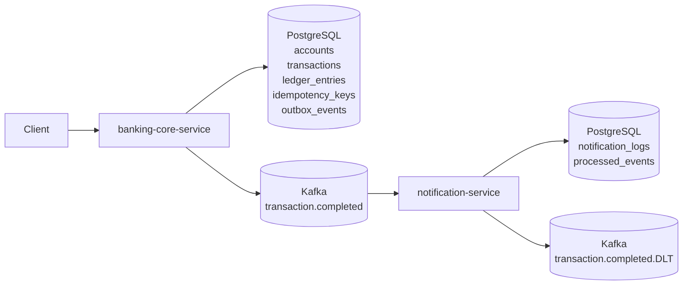
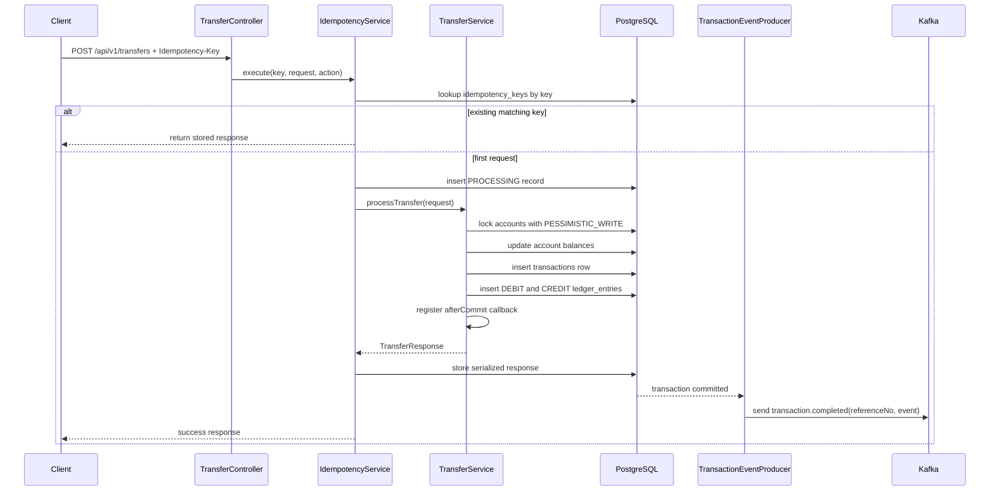

# Kafka Core Banking Flow

This document explains the checked-in data flow across `banking-core-service`, PostgreSQL, Kafka, and `notification-service`.

## Scope And Current Status

- Account creation, transfer, ledger persistence, idempotency, Kafka publishing, notification consumption, duplicate protection, and consumer DLT handling are implemented in code.
- `banking-core-service` also contains outbox table/entity/factory/publisher-job code.
- The current transfer path still publishes directly from `TransferService` after the database transaction commits.
- The outbox publisher job is active as a scheduled component, but `TransferService` does not currently save transfer events into `outbox_events`.
- No checked-in end-of-day batch job was found. The closest implemented read path is the account statement endpoint backed by `ledger_entries`.

## High-Level Architecture



## Account Creation Flow

Flow:

```text
Client
-> POST /api/v1/accounts
-> AccountController
-> AccountService.createAccount(...)
-> validate opening balance
-> check account number uniqueness
-> AccountRepository.save(...)
-> accounts
```

Step-by-step:

1. The client calls `POST /api/v1/accounts`.
2. `AccountController` delegates to `AccountService.createAccount(...)`.
3. The service normalizes `balance` to `0` when missing.
4. The service rejects negative opening balances.
5. The service checks `existsByAccountNo(...)`.
6. The account is saved with status `ACTIVE`.
7. A duplicate insert is also protected by the database unique index on `accounts.account_no`.

## Transfer Flow

Flow:

```text
Client
-> POST /api/v1/transfers
-> TransferController
-> IdempotencyService.execute(...)
-> TransferService.processTransfer(...)
-> lock both accounts
-> validate business rules
-> update balances
-> save transaction row
-> save two ledger rows
-> after commit publish Kafka event
```



Important details:

- `TransferController` requires the `Idempotency-Key` header.
- `TransferService` validates:
  - amount greater than zero
  - different source and destination accounts
  - both accounts exist
  - both accounts are `ACTIVE`
  - request currency matches both accounts
  - source account has sufficient balance
- Account rows are loaded in sorted order and locked with `PESSIMISTIC_WRITE`.
- The event is created before commit and published in `afterCommit`.

## Ledger Flow

Each successful transfer writes:

- one `transactions` row with:
  - `reference_no`
  - `type = TRANSFER`
  - `status = SUCCESS`
  - `from_account_no`
  - `to_account_no`
  - `amount`
  - `currency`
  - `created_at`
- two `ledger_entries` rows:
  - one `DEBIT` for the source account
  - one `CREDIT` for the destination account

Ledger flow:

```text
Transfer validated
-> debit source balance
-> credit destination balance
-> save transaction reference
-> save source DEBIT ledger entry with balance_after
-> save destination CREDIT ledger entry with balance_after
```

`ledger_entries` is also the data source used by the account statement endpoint.

## Outbox Pattern Flow

Status:

- Outbox infrastructure exists in code and schema.
- The active transfer path does not currently persist transfer events into `outbox_events`.

Outbox tables and code:

- `outbox_events`
- `OutboxEventEntity`
- `OutboxEventFactory`
- `OutboxEventRepository`
- `OutboxPublisherJob`

```mermaid
flowchart TD
    A[Producer creates outbox_events row with status NEW] --> B[OutboxPublisherJob runs on fixed delay]
    B --> C[Load top 100 NEW events ordered by created_at]
    C --> D[Deserialize payload to TransactionCompletedEvent]
    D --> E[TransactionEventProducer.publish(...)]
    E --> F[Mark row PUBLISHED and set published_at]
    E -. publish failure .-> G[Mark row FAILED, increment retry_count, store last_error]
```

Important detail:

- `OutboxPublisherJob` only polls rows with status `NEW`.
- On failure it marks rows `FAILED` and increments `retry_count`.
- No checked-in code moves `FAILED` rows back to `NEW`, so failed outbox rows are recorded but not automatically retried by this job as written.

## Kafka Producer Flow

Current producer flow:

```text
TransferService
-> build TransactionCompletedEvent
-> TransactionSynchronization.afterCommit
-> TransactionEventProducer.publish(...)
-> KafkaTemplate.send(topic, referenceNo, event).get()
-> topic transaction.completed
```

Producer characteristics:

- Topic: `transaction.completed`
- Key: `referenceNo`
- Value: `TransactionCompletedEvent` serialized as JSON
- Producer ack mode: `acks=all`
- Producer retry count: `3`
- Send call is synchronous because `publish(...)` waits on `.get()`

This reduces the risk of publishing before commit, but it is still a separate step after the database transaction commits.

## Notification Consumer Flow

```mermaid
flowchart TD
    A[Kafka topic transaction.completed] --> B[TransactionCompletedConsumer]
    B --> C{Required fields present?}
    C -- No --> D[Log warning and ignore]
    C -- Yes --> E[TransactionCompletedEventHandler.handle(...)]
    E --> F{processed_events already contains eventId?}
    F -- Yes --> G[Log duplicate and stop]
    F -- No --> H[registerIfAbsent(eventId, topic)]
    H -- false --> I[Duplicate hit unique constraint and stop]
    H -- true --> J[NotificationService.createNotificationLog(...)]
    J --> K[notification_logs insert]
```

Step-by-step:

1. Spring Kafka deserializes the record into `TransactionCompletedEvent`.
2. `TransactionCompletedConsumer` checks `eventId`, `referenceNo`, and `amount`.
3. Invalid events are logged and ignored.
4. Valid events are processed inside a transaction by `TransactionCompletedEventHandler`.
5. The handler checks `processed_events`.
6. The handler reserves the event by inserting into `processed_events`.
7. Only after successful registration does it write `notification_logs`.

## `processed_events` Duplicate Handling

Duplicate delivery is expected in an at-least-once Kafka flow. This project handles it with both an existence check and a unique insert guard.

Flow:

```text
event arrives
-> existsByEventId(...)
-> if already processed: stop
-> else insert processed_events(eventId, topic, processedAt)
-> if unique constraint fails: stop
-> else create notification_logs row
```

Why both checks exist:

- `existsByEventId(...)` avoids unnecessary work in the common duplicate case.
- `registerIfAbsent(...)` protects against concurrent consumers or redelivery races.
- The unique constraint on `processed_events.event_id` is the final duplicate barrier.

Expected outcome:

- many deliveries of the same `eventId`
- at most one `notification_logs` row for that `eventId`

## Kafka Retry / DLT Flow

The checked-in retry and DLT behavior is on the consumer side in `notification-service`.

Flow:

```text
consume record
-> deserialize with ErrorHandlingDeserializer
-> listener or handler throws
-> DefaultErrorHandler retries 2 times
-> if still failing, publish to transaction.completed.DLT
```

Configured behavior:

- Listener topic: `transaction.completed`
- DLT topic: `transaction.completed.DLT`
- Backoff implementation: `ExponentialBackOffWithMaxRetries(2)`
- Effective retry delay: `1000 ms`
- `DeserializationException` and `SerializationException` are marked not retryable
- DLT publishing uses `DeadLetterPublishingRecoverer`

Practical effect:

- poison JSON does not block the consumer forever
- deserialization failures skip retries and go to recovery handling
- handler failures are retried, then sent to the DLT after retries are exhausted

## Idempotency-Key Flow

The transfer API is idempotent at the HTTP request level.

Flow:

```text
POST /api/v1/transfers with Idempotency-Key
-> normalize key
-> hash request body with SHA-256
-> lookup idempotency_keys
-> if same key + same request: return saved response
-> if same key + different request: reject conflict
-> if new key: save PROCESSING record
-> execute transfer
-> save serialized response body and final status
```

Important behavior:

- Missing or blank `Idempotency-Key` is rejected.
- The service stores:
  - `idempotency_key`
  - `request_hash`
  - `response_body`
  - `status`
  - `created_at`
- If the same key is reused with a different request body, the service throws `IDEMPOTENCY_KEY_CONFLICT`.
- If a duplicate request arrives while the first one is still in progress, the stored record has no response body yet and the service returns an internal-processing error.

## Account Locking / Concurrency Flow

The transfer flow uses database row locking to keep balance updates consistent.

Flow:

```text
transfer request
-> sort source and destination account numbers
-> select both rows with PESSIMISTIC_WRITE
-> hold lock for the transaction
-> validate balances and status
-> update both balances
-> commit
-> release locks
```

Why the sorting matters:

- both requests lock accounts in the same order
- this reduces deadlock risk for opposite-direction concurrent transfers

What the lock protects:

- double spending from concurrent debits
- inconsistent source/destination balance updates within the same transfer

## EOD Batch Summary Flow

Status:

- No checked-in end-of-day batch job, scheduler, or summary writer was found.
- `Unknown / needs confirmation` for any real EOD batch implementation.

Closest implemented flow:

```text
Client
-> GET /api/v1/accounts/{accountNo}/statement
-> AccountController
-> AccountService.getStatement(...)
-> validate date/page inputs
-> query ledger_entries by account and date range
-> return paged statement entries
```

What this means for documentation:

- The current code can read ledger history for a date range.
- The current code does not run an automated EOD aggregation or publish an EOD summary event.
- If an EOD batch is added later, `ledger_entries` and `transactions` are the checked-in sources that already contain the daily transfer history.

## Evidence Basis

This document is based on:

- `banking-core-service/src/main/java/com/minh/bankingcore/account/*`
- `banking-core-service/src/main/java/com/minh/bankingcore/transaction/*`
- `banking-core-service/src/main/java/com/minh/bankingcore/ledger/*`
- `banking-core-service/src/main/java/com/minh/bankingcore/idempotency/*`
- `banking-core-service/src/main/java/com/minh/bankingcore/kafka/*`
- `banking-core-service/src/main/java/com/minh/bankingcore/outbox/*`
- `banking-core-service/src/main/resources/application.yml`
- `banking-core-service/src/main/resources/db/migration/*`
- `notification-service/src/main/java/com/minh/notification/consumer/*`
- `notification-service/src/main/java/com/minh/notification/notification/*`
- `notification-service/src/main/java/com/minh/notification/processed_event/*`
- `notification-service/src/main/java/com/minh/notification/config/*`
- `notification-service/src/main/resources/application.yml`
- `notification-service/src/main/resources/db/migration/*`
