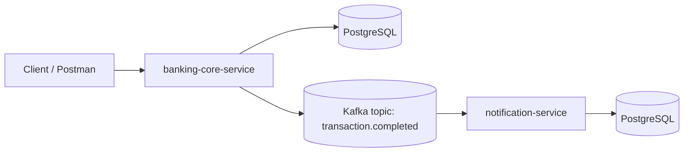
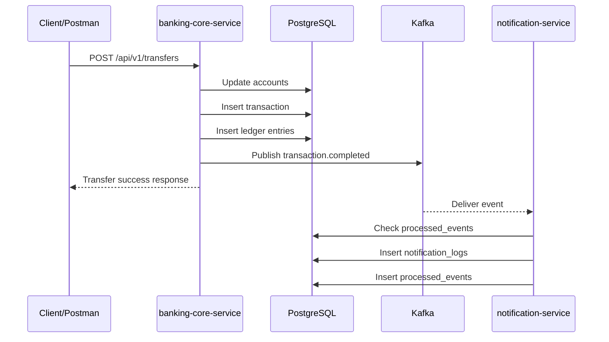

# Kafka Data Flow In This Project

This document explains the actual runtime data flow between `banking-core-service`, Kafka, and `notification-service` based on the checked-in controllers, services, Kafka configuration, JPA entities, and Flyway migrations.

## 1. Overall architecture



### Role of each component

- `banking-core-service` is the Kafka producer. It receives account and transfer API requests, updates banking data in PostgreSQL, and publishes a `TransactionCompletedEvent` after the transfer transaction commits.
- Kafka topic `transaction.completed` is the event channel. It stores completed-transfer events so the producer and consumer do not need to call each other directly.
- `notification-service` is the Kafka consumer. It reads `transaction.completed` events, validates them, applies duplicate protection, and stores notification/audit-style records.
- PostgreSQL stores the persistent state for both services:
  - `banking-core-service`: `accounts`, `transactions`, `ledger_entries`
  - `notification-service`: `notification_logs`, `processed_events`

## 2. Account creation data flow

The account creation path is:

```text
Client
-> POST /api/v1/accounts
-> AccountController
-> AccountService
-> AccountRepository
-> accounts table
```

### Step-by-step

1. The client calls `POST /api/v1/accounts`.
2. `AccountController` receives the JSON request body and delegates to `AccountService#createAccount`.
3. `AccountService` normalizes the opening balance:
   - if `balance` is missing, it uses `0`
   - if `balance < 0`, it rejects the request
4. The service checks whether the account number already exists.
5. It builds an `AccountEntity` with status `ACTIVE`.
6. `AccountRepository.save(...)` writes the row to the `accounts` table.

### What is saved in `accounts`

Each account row stores:

- `account_no`
- `customer_name`
- `balance`
- `currency`
- `status`
- `created_at`
- `updated_at`

`id` is generated by the database.

## 3. Transfer data flow before Kafka

The transfer path is:

```text
Client
-> POST /api/v1/transfers
-> TransferController
-> TransferService
-> validate request
-> load source account
-> load destination account
-> debit source account
-> credit destination account
-> save transaction
-> save two ledger entries
```

### Step-by-step

1. The client calls `POST /api/v1/transfers`.
2. `TransferController` delegates to `TransferService#transfer`.
3. `TransferService` validates the request:
   - amount must be greater than zero
   - source and destination accounts must be different
4. The service loads both accounts in one query using `findAllByAccountNoInForUpdate(...)`.
   - This uses a pessimistic write lock so both account rows are locked during the transaction.
5. The service verifies both accounts exist.
6. It validates business conditions:
   - both accounts must be `ACTIVE`
   - request currency must match both account currencies
   - source account must have enough balance
7. It debits the source account balance.
8. It credits the destination account balance.
9. It saves both updated account rows.
10. It generates a new transaction reference number.
11. It saves one row in `transactions`.
12. It saves two rows in `ledger_entries`.

### Database changes

`accounts`

- source account balance decreases
- destination account balance increases

`transactions`

- one row with `type = TRANSFER`
- one row with `status = SUCCESS`
- same row also stores `reference_no`, `from_account_no`, `to_account_no`, `amount`, `currency`, `created_at`

`ledger_entries`

- one `DEBIT` row for the source account
- one `CREDIT` row for the destination account
- each row stores `transaction_reference_no`, `account_no`, `amount`, `balance_after`, `description`, `created_at`

## 4. Kafka producer flow

After the transfer data is saved, the producer flow is:

```text
Transfer success
-> create TransactionCompletedEvent
-> KafkaTemplate sends event
-> topic transaction.completed
```

### Important runtime detail

The event is created inside `TransferService`, but it is published with an `afterCommit` callback. That means:

- the transfer database transaction commits first
- then `TransactionEventProducer.publish(...)` runs
- then `KafkaTemplate` sends the event to Kafka

So the producer does not publish before the transfer commit succeeds.

### Event example

```json
{
  "eventId": "uuid",
  "eventType": "TRANSACTION_COMPLETED",
  "referenceNo": "TXN001",
  "fromAccountNo": "100001",
  "toAccountNo": "100002",
  "amount": 100000,
  "currency": "VND",
  "occurredAt": "2026-06-11T22:30:00"
}
```

### Producer details in this project

- Topic name: `transaction.completed`
- Message key: `referenceNo`
- Message value: JSON form of `TransactionCompletedEvent`
- Producer implementation: `TransactionEventProducer`
- Producer transport: `KafkaTemplate<String, TransactionCompletedEvent>`
- The producer does not call `notification-service` directly. It only writes to Kafka.

## 5. Kafka broker/topic flow

At a simple level:

```text
Kafka stores the event in topic transaction.completed.
notification-service reads the event later using consumer group notification-service.
```

### Kafka concepts in this project

- Producer: `banking-core-service`
  - It sends completed-transfer events to Kafka.
- Topic: `transaction.completed`
  - This is the named stream where transfer-completed events are stored.
- Message key: `referenceNo`
  - The producer uses the transfer reference number as the Kafka key.
- Message value: event JSON payload
  - The payload contains `eventId`, transfer data, amount, currency, and time.
- Consumer: `notification-service`
  - It listens to `transaction.completed`.
- Consumer group: `notification-service`
  - Kafka tracks consumption progress for this service under that group id.
- Offset:
  - Kafka gives each record a position in the topic called an offset.
  - The consumer group commits offsets to remember how far it has already read.
- At-least-once delivery:
  - Kafka and the consumer may deliver the same event more than once.
  - Because of that, `notification-service` must be idempotent.

## 6. Notification consumer flow

The consumer-side runtime path is:

```text
Kafka topic transaction.completed
-> TransactionCompletedConsumer
-> deserialize JSON to TransactionCompletedEvent
-> validate event
-> check processed_events by eventId
-> if duplicate: skip
-> if new: save notification_logs
-> save processed_events
```

### Actual implementation detail

The checked-in code follows this exact order:

```text
Kafka topic transaction.completed
-> TransactionCompletedConsumer
-> deserialize JSON to TransactionCompletedEvent
-> validate required fields
-> TransactionCompletedEventHandler
-> check processed_events by eventId
-> try to insert processed_events first
-> if duplicate: skip
-> if new: save notification_logs
```

This is slightly different from the conceptual flow above. The service registers the `eventId` in `processed_events` before inserting `notification_logs`. That reservation step helps protect against duplicate writes when the same event is consumed concurrently or redelivered.

### Step-by-step

1. Kafka delivers a record from `transaction.completed` to `TransactionCompletedConsumer`.
2. Spring Kafka deserializes the JSON payload into `TransactionCompletedEvent`.
3. The consumer validates required fields:
   - `eventId`
   - `referenceNo`
   - `amount`
4. If the event is invalid, the consumer logs a warning and returns without calling the handler.
5. If the event is valid, `TransactionCompletedEventHandler.handle(...)` runs inside a database transaction.
6. The handler checks `processed_events` using `existsByEventId(...)`.
7. The handler calls `registerIfAbsent(...)`:
   - if the `eventId` already exists, processing stops
   - if the `eventId` is new, a `processed_events` row is inserted
8. `NotificationService.createNotificationLog(...)` inserts one `notification_logs` row with an audit-style message.

### Database changes

`notification_logs`

- stores one notification/audit-style message derived from the event
- stores `event_id`, `reference_no`, `from_account_no`, `to_account_no`, `amount`, `currency`, `message`, `status`, `created_at`

`processed_events`

- stores `event_id` to avoid duplicate processing
- also stores `topic` and `processed_at`
- has a unique constraint on `event_id`

## 7. Duplicate event handling

Duplicate events can happen because:

```text
Kafka may deliver a message more than once.
The consumer may restart after processing but before committing offset.
Manual resend may send the same event again.
```

### Expected behavior

```text
Same eventId consumed multiple times
-> only one notification_logs row should be created
```

### How this project achieves that

- `processed_events.event_id` is unique.
- The handler checks `existsByEventId(...)` first.
- It then attempts `registerIfAbsent(...)`.
- If the same event is processed again, the duplicate insert hits the unique constraint and the handler skips creating another notification log.

This means duplicate delivery should not create duplicate business-side notification records for the same `eventId`.

## 8. Poison message / invalid JSON flow

### The issue

```text
If topic contains invalid JSON or old event format,
consumer may fail deserialization.
Without ErrorHandlingDeserializer, it can retry the same bad offset forever.
```

### Current fix in this project

`notification-service` already applies the fix conceptually:

```text
ErrorHandlingDeserializer + DefaultErrorHandler
-> treat deserialization/serialization failures as not retryable
-> skip bad record after the configured attempts
-> log error
-> continue consuming valid records
```

### What is configured

- `ErrorHandlingDeserializer` wraps both key and value deserialization
- the delegated value deserializer is `JacksonJsonDeserializer`
- `DefaultErrorHandler` is configured in `KafkaConsumerConfig`
- `DeserializationException` and `SerializationException` are marked not retryable
- the handler uses a fixed backoff of `1000 ms` and `2` retry attempts before skipping

So this project is already protected against a poison message permanently blocking the consumer on the same offset.

## 9. End-to-end sequence diagram



### Actual ordering note

The diagram above matches the high-level flow. In the current implementation, `notification-service` inserts `processed_events` before `notification_logs`, and `banking-core-service` publishes to Kafka after the database commit.

## 10. Important learning notes

- Kafka is asynchronous.
  - `banking-core-service` publishes an event and does not wait for `notification-service` to execute business logic.
- `banking-core-service` should still work even if `notification-service` is down.
  - The producer writes to Kafka, not directly to the consumer service.
- When `notification-service` restarts, it can continue consuming from Kafka.
  - Kafka keeps the topic data and the consumer group offset state.
- Kafka helps decouple producer and consumer.
  - Each service can evolve independently around the event contract.
- In the current version, the producer publishes directly from `TransferService` after the transfer transaction commits.
  - There is no separate outbox table in `banking-core-service`.
- Later, the outbox pattern can improve consistency between database commit and Kafka publish.
  - Right now the service reduces risk by publishing after commit, but database commit and Kafka send are still two separate systems.

## Evidence basis

This document is based on these checked-in runtime paths and configs:

- `banking-core-service/src/main/java/com/minh/bankingcore/account/*`
- `banking-core-service/src/main/java/com/minh/bankingcore/transaction/*`
- `banking-core-service/src/main/java/com/minh/bankingcore/kafka/*`
- `banking-core-service/src/main/java/com/minh/bankingcore/ledger/*`
- `banking-core-service/src/main/resources/application.yml`
- `banking-core-service/src/main/resources/db/migration/V1__init_core_banking_tables.sql`
- `notification-service/src/main/java/com/minh/notification/consumer/*`
- `notification-service/src/main/java/com/minh/notification/notification/*`
- `notification-service/src/main/java/com/minh/notification/processed_event/*`
- `notification-service/src/main/java/com/minh/notification/config/*`
- `notification-service/src/main/resources/application.yml`
- `notification-service/src/main/resources/db/migration/V2__init_notification_tables.sql`
